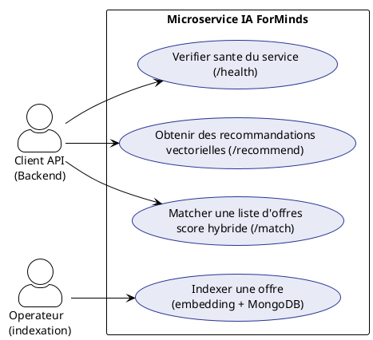
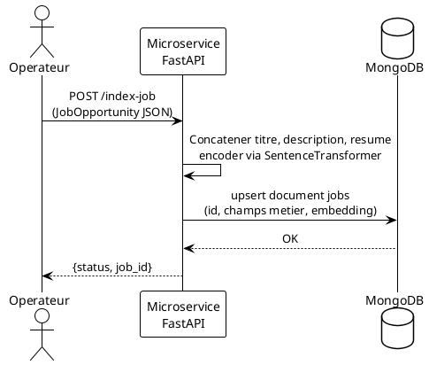
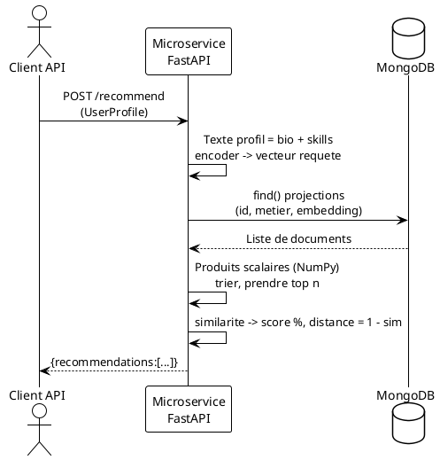
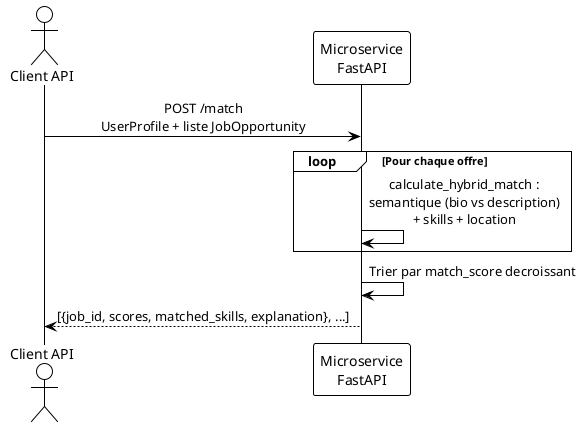
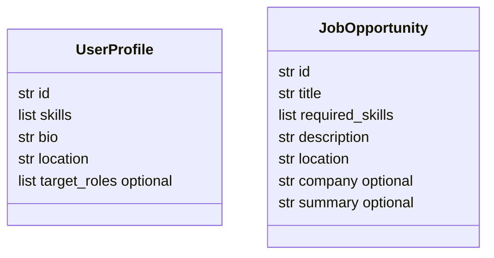

# Documentation technique

## Microservice ForMinds — Matching IA (FastAPI)

> **Projet de Fin d'Études** | Auteur : Hamdi Ahmed | Encadrant : Wertani Oussama  
> **Périmètre de ce document :** dépôt *ai-service* uniquement — Stack : FastAPI · Sentence-Transformers · MongoDB · Pydantic · Docker

---

## Table des matières

1. [Périmètre du service](#1-périmètre-du-service)
2. [Architecture du moteur de matching](#2-architecture-du-moteur-de-matching)
3. [Diagramme de cas d'utilisation](#3-diagramme-de-cas-dutilisation)
4. [Diagrammes de séquence](#4-diagrammes-de-séquence)
5. [Modèles applicatifs (code Python)](#5-modèles-applicatifs-code-python)
6. [Modèle de données MongoDB](#6-modèle-de-données-mongodb)
7. [Algorithme de scoring](#7-algorithme-de-scoring)
8. [Argumentaire technique](#8-argumentaire-technique)

---

## 1. Périmètre du service

Ce dépôt héberge le **microservice IA** responsable du matching sémantique entre profils étudiants et offres. Il est exposé sous forme d’API REST FastAPI, conteneurisé avec Docker, et persiste les embeddings des offres dans **MongoDB** (collection configurable, par défaut `jobs`).

Fonctions principales :

- **Indexer** une offre (texte → vecteur → document MongoDB).
- **Recommander** les offres les plus proches d’un profil (`POST /recommend`, similarité sur vecteurs MongoDB).
- **Matcher** une liste d’offres fournie en entrée avec un score hybride (`POST /match`).
- **Vérifier** la disponibilité du service et du modèle (`GET /health`).

Un client backend (ex. Express.js) peut appeler ces endpoints ; leur implémentation ne fait pas partie de ce dépôt.

---

## 2. Architecture du moteur de matching

### 2.1 Vue d’ensemble

Le service fonctionne comme **processus isolé** : chargement paresseux du modèle Sentence-Transformers, connexion MongoDB avec retry, et endpoints sans état (sauf le cache disque du modèle).

### 2.2 Deux modes de matching

**Recommandation vectorielle (`/recommend`).** Le profil étudiant est encodé à partir de la bio et des compétences ; les vecteurs des offres sont lus depuis MongoDB et classés par **produit scalaire** (équivalent au cosinus, les embeddings étant normalisés L2). Les $k$ meilleurs scores sont renvoyés.

**Matching hybride (`/match`).** Pour chaque offre envoyée dans le corps de la requête, le moteur calcule un score combinant similarité **bio ↔ description**, recouvrement des **compétences** et **égalité de lieu**, avec des pondérations configurables (voir section 7).

### 2.3 Modèle `paraphrase-multilingual-MiniLM-L12-v2`

Multilingue, léger, adapté aux textes courts (compétences, descriptions d’offres). Les embeddings sont normalisés (L2) pour la cohérence avec la similarité cosinus.

### 2.4 Similarité cosinus côté application

$$\cos(\theta) = \frac{\vec{A} \cdot \vec{B}}{||\vec{A}|| \cdot ||\vec{B}||}$$

Les embeddings produits par le service sont **normalisés L2**, donc $\cos(\theta) = \vec{A} \cdot \vec{B}$. L’implémentation charge les documents de la collection, empile les vecteurs dans une matrice NumPy et calcule les similarités par produit matrice–vecteur, puis retient les indices des $k$ plus grands scores.

La réponse API expose à la fois `match_score` (similarité en %) et `distance` défini comme $1 - \text{similarité}$ pour rester cohérent avec l’ancienne sémantique « distance cosinus ».

### 2.5 Scalabilité

Le classement actuel est **en mémoire** sur l’ensemble des offres indexées : adapté à des milliers de documents ; au-delà, envisager **MongoDB Atlas Vector Search** ou une base vectorielle dédiée pour un rappel approximatif sans tout charger.

---

## 3. Diagramme de cas d'utilisation

### 3.1 Acteurs

| Acteur | Rôle |
|--------|------|
| **Client API** | Application backend qui appelle le microservice (authentification gérée en amont). |
| **Administrateur / pipeline** | Peut indexer des offres via `POST /index-job`. |

### 3.2 Cas d’utilisation

Ce schéma résume ce que **ce dépôt** expose réellement : indexation des offres, recommandation par vecteurs, calcul hybride sur une liste fournie, et point de santé. Il ne figure pas ici les écrans Next.js, la gestion JWT ni d’autres modules de la plateforme globale.

---

## 4. Diagrammes de séquence

### 4.1 Indexer une offre (`POST /index-job`)

Le flux commence par la construction d’un texte représentatif de l’offre, puis son embedding 384 dimensions. Le document est enregistré dans MongoDB avec **upsert** sur le champ `id`, ce qui permet de réindexer une offre après modification.

### 4.2 Recommandations vectorielles (`POST /recommend`)

Ici, le profil n’est pas stocké : seul le vecteur de requête est calculé à la volée. Les embeddings sont récupérés depuis MongoDB puis triés en mémoire ; le score renvoyé reflète cette similarité vectorielle (pas le score hybride de `/match`).

### 4.3 Matching hybride (`POST /match`)

L’endpoint `/match` ne lit pas la base : il sert surtout de démonstration ou d’outil pour un lot d’offres déjà en mémoire côté client. Chaque paire (profil, offre) produit des sous-scores et une courte explication textuelle.

---

## 5. Modèles applicatifs (code Python)

### 5.1 Schéma simplifié (Mermaid)

Les classes **UserProfile** et **JobOpportunity** sont des modèles **Pydantic** (`app/models.py`). Ils valident les entrées JSON des endpoints et documentent les exemples OpenAPI. Les champs optionnels `company`, `summary` et `target_roles` enrichissent l’indexation ou l’UI sans être tous utilisés dans chaque formule de score.

---

## 6. Modèle de données MongoDB

Collection configurable (`MONGODB_COLLECTION`, défaut `jobs`), base `MONGODB_DB_NAME`. Au démarrage, `init_db` crée un **index unique** sur le champ `id`.

Document type pour une offre indexée :

| Champ | Type | Description |
|-------|------|-------------|
| `id` | string | Clé métier unique (fournie par l’appelant). |
| `title`, `description`, `location`, … | divers | Miroir des champs `JobOpportunity`. |
| `required_skills` | array de strings | Compétences requises. |
| `embedding` | array de doubles | Vecteur de dimension 384 (MiniLM). |
| `created_at` | date | Renseigné à l’insert (`$setOnInsert`). |

Chaque offre indexée possède un vecteur de taille fixe, aligné sur le modèle MiniLM.

---

## 7. Algorithme de scoring

### 7.1 Matching hybride (`calculate_hybrid_match`)

Formule implémentée dans `app/engine.py` (pondérations par défaut dans `app/config.py`) :

$$S_{final} = w_{sem} \cdot S_{semantique} + w_{skill} \cdot S_{skills} + w_{loc} \cdot S_{location}$$

Valeurs par défaut : $w_{sem} = 0{,}70$, $w_{skill} = 0{,}25$, $w_{loc} = 0{,}05$ (modifiables via variables d’environnement).

- **Sémantique** : cosinus entre embeddings de `user.bio` et `job.description`.
- **Compétences** : proportion des compétences requises présentes chez l’étudiant (normalisation basique des chaînes).
- **Lieu** : 1 si les lieux normalisés sont identiques, sinon 0.

Un texte d’**explication** (`reason`) est généré selon le score final et les compétences intersectées.

### 7.2 Affichage des scores (référence UI)

Pour une barre de progression type « jauge », on peut reprendre des seuils indicatifs :

| Seuil | Interprétation |
|-------|----------------|
| score ≥ 80 | Excellent alignement |
| score ≥ 50 | Potentiel intéressant |
| score < 50 | Faible correspondance |

*(Ces seuils sont cohérents avec la logique de `_build_reason` dans `engine.py` ; le style visuel exact dépend du frontend consommateur.)*

---

## 8. Argumentaire technique

**MongoDB** simplifie l’hébergement pour les équipes déjà sur l’écosystème document, et stocke naturellement tableaux d’embeddings. Le compromis actuel est un **Top‑K en mémoire** : simple et exact pour des volumes modérés ; pour de très gros catalogues, une recherche vectorielle indexée (Atlas ou service dédié) sera plus adaptée.

**Découplage** : le modèle lourd et l’indexation restent dans ce microservice ; le client backend n’a qu’à appeler HTTP.

---

Date : 03/04/2026
