# Diagrammes UML — ForMinds Platform

---

## 1. Diagramme de Cas d'Utilisation Global (Macro Vision)

```plantuml
@startuml UC_Global
!theme plain
skinparam actorStyle awesome
skinparam packageStyle rectangle
skinparam usecaseBackgroundColor #F0F4FF
skinparam usecaseBorderColor #3366CC
skinparam actorBackgroundColor #FFCC00
left to right direction

actor "Etudiant" as student
actor "Recruteur" as recruiter
actor "Admin" as admin
actor "Service IA" as ai <<system>>
actor "Service Email" as email <<system>>

rectangle "ForMinds Platform" {

  package "Authentification & Gestion des Roles (BF-001)" {
    usecase "S'inscrire" as UC_REGISTER
    usecase "Se connecter" as UC_LOGIN
    usecase "Se deconnecter" as UC_LOGOUT
    usecase "Reinitialiser mot de passe" as UC_RESET_PWD
    usecase "Verifier email" as UC_VERIFY_EMAIL
    usecase "Activer 2FA" as UC_ENABLE_2FA
    usecase "Desactiver 2FA" as UC_DISABLE_2FA
    usecase "Verifier 2FA" as UC_VERIFY_2FA
  }

  package "Profils & Portfolio (BF-002)" {
    usecase "Gerer profil etudiant" as UC_PROFILE_STU
    usecase "Gerer profil recruteur" as UC_PROFILE_REC
    usecase "Gerer portfolio\n(projets, education,\nexperiences)" as UC_PORTFOLIO
    usecase "Uploader CV" as UC_CV
    usecase "Uploader avatar" as UC_AVATAR
    usecase "Consulter profil public" as UC_PUBLIC_PROFILE
  }

  package "Networking & Annuaire (BF-003)" {
    usecase "Envoyer demande\nde connexion" as UC_CONNECT_REQ
    usecase "Accepter / Refuser\nconnexion" as UC_CONNECT_RESP
    usecase "Consulter annuaire\ndes profils" as UC_DIRECTORY
    usecase "Rechercher profils\n(skills, domaine, ville)" as UC_SEARCH_PROFILES
  }

  package "Opportunites & Candidatures (BF-004)" {
    usecase "Publier une opportunite" as UC_POST_OPP
    usecase "Rechercher opportunites" as UC_SEARCH_OPP
    usecase "Postuler a une\nopportunite" as UC_APPLY
    usecase "Suivre ses candidatures" as UC_TRACK_APP
  }

  package "Matching IA (BF-005)" {
    usecase "Obtenir recommandations\npersonnalisees" as UC_MATCH
    usecase "Calculer score\nde matching" as UC_SCORE
  }

  package "Evenements Hybrides (BF-006)" {
    usecase "Creer un evenement" as UC_CREATE_EVENT
    usecase "S'inscrire a\nun evenement" as UC_JOIN_EVENT
    usecase "Generer QR Code\nparticipant" as UC_QR_GEN
    usecase "Check-in QR" as UC_QR_CHECKIN
  }

  package "Administration (BF-007)" {
    usecase "Consulter dashboard\nadmin" as UC_DASHBOARD
    usecase "Valider / Rejeter\nopportunites" as UC_VALIDATE_OPP
    usecase "Valider role recruteur" as UC_VALIDATE_RECRUITER
    usecase "Suspendre / Reactiver\nutilisateur" as UC_MANAGE_USERS
    usecase "Consulter journal\nd'audit" as UC_AUDIT_LOG
  }
}

' --- Etudiant ---
student --> UC_REGISTER
student --> UC_LOGIN
student --> UC_LOGOUT
student --> UC_RESET_PWD
student --> UC_VERIFY_EMAIL
student --> UC_ENABLE_2FA
student --> UC_DISABLE_2FA
student --> UC_PROFILE_STU
student --> UC_PORTFOLIO
student --> UC_CV
student --> UC_AVATAR
student --> UC_PUBLIC_PROFILE
student --> UC_CONNECT_REQ
student --> UC_CONNECT_RESP
student --> UC_DIRECTORY
student --> UC_SEARCH_PROFILES
student --> UC_SEARCH_OPP
student --> UC_APPLY
student --> UC_TRACK_APP
student --> UC_MATCH
student --> UC_JOIN_EVENT
student --> UC_QR_GEN

' --- Recruteur ---
recruiter --> UC_REGISTER
recruiter --> UC_LOGIN
recruiter --> UC_LOGOUT
recruiter --> UC_RESET_PWD
recruiter --> UC_VERIFY_EMAIL
recruiter --> UC_ENABLE_2FA
recruiter --> UC_DISABLE_2FA
recruiter --> UC_PROFILE_REC
recruiter --> UC_AVATAR
recruiter --> UC_PUBLIC_PROFILE
recruiter --> UC_CONNECT_REQ
recruiter --> UC_CONNECT_RESP
recruiter --> UC_DIRECTORY
recruiter --> UC_SEARCH_PROFILES
recruiter --> UC_POST_OPP
recruiter --> UC_SEARCH_OPP
recruiter --> UC_CREATE_EVENT
recruiter --> UC_QR_CHECKIN

' --- Admin ---
admin --> UC_LOGIN
admin --> UC_LOGOUT
admin --> UC_DASHBOARD
admin --> UC_VALIDATE_OPP
admin --> UC_VALIDATE_RECRUITER
admin --> UC_MANAGE_USERS
admin --> UC_AUDIT_LOG
admin --> UC_CREATE_EVENT

' --- Systemes ---
UC_REGISTER ..> email : <<include>>
UC_VERIFY_EMAIL ..> email : <<include>>
UC_RESET_PWD ..> email : <<include>>
UC_ENABLE_2FA ..> email : <<include>>
UC_MATCH ..> ai : <<include>>
UC_SCORE ..> ai : <<include>>
UC_MATCH ..> UC_SCORE : <<include>>

UC_LOGIN ..> UC_VERIFY_2FA : <<extend>>

@enduml
```

---

## 2. Diagramme de Cas d'Utilisation — Sprint 1

Sprint 1 couvre : **BF-001 (Auth complete)** + **BF-002 partiel (Profils de base)**

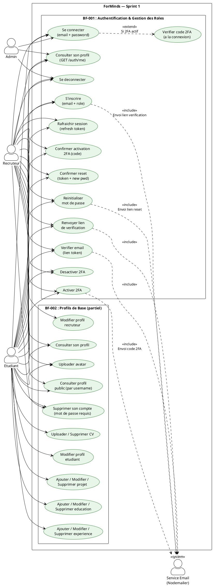

---

## 3. Diagrammes de Sequence — Sprint 1

### 3.1 Inscription (Register)

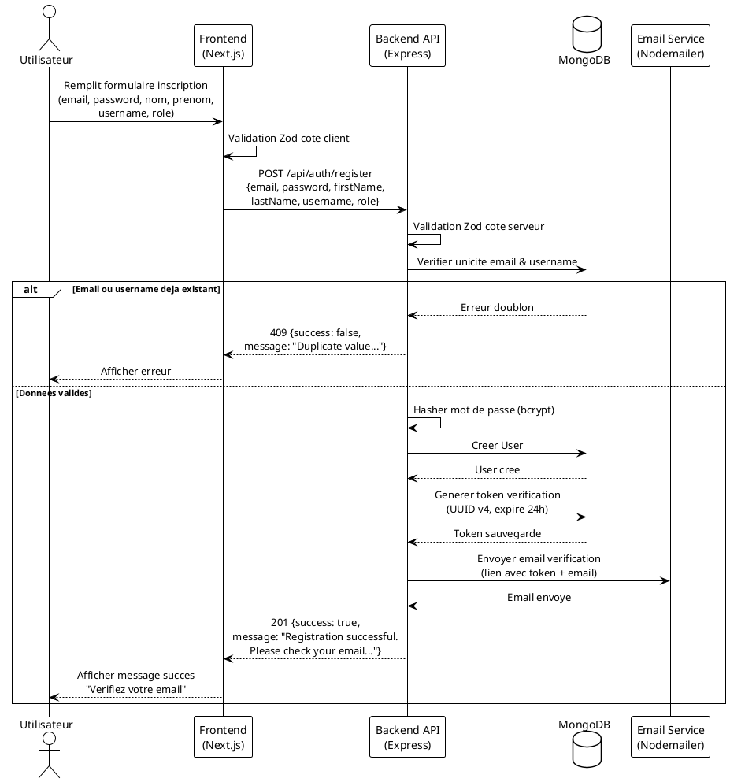

### 3.2 Verification Email

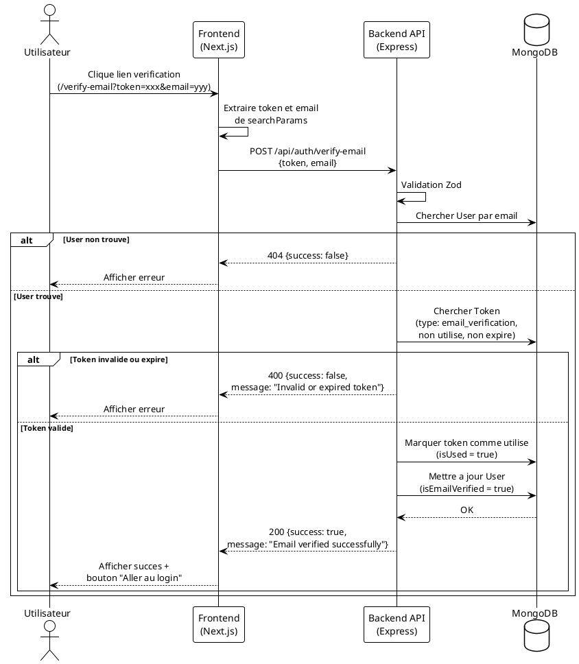

### 3.3 Connexion (Login)

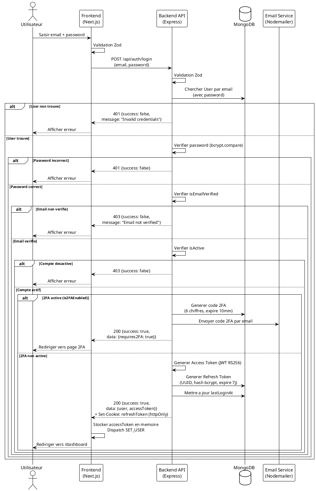

### 3.4 Verification 2FA

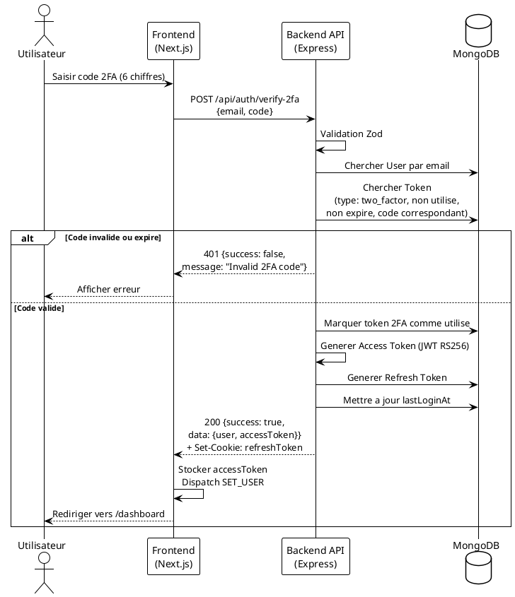

### 3.5 Desactivation 2FA

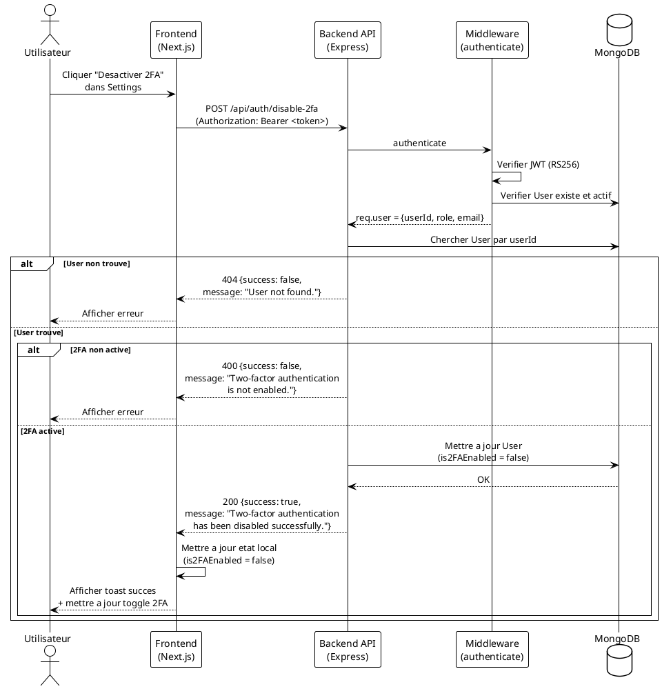

### 3.6 Rafraichissement de Session (Refresh Token)

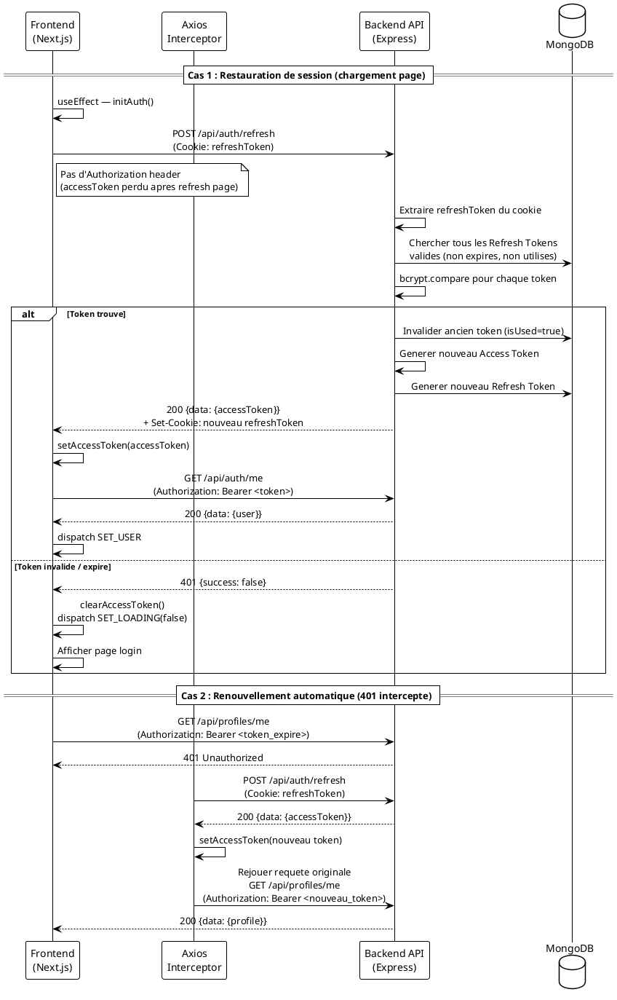

### 3.7 Reinitialisation Mot de Passe

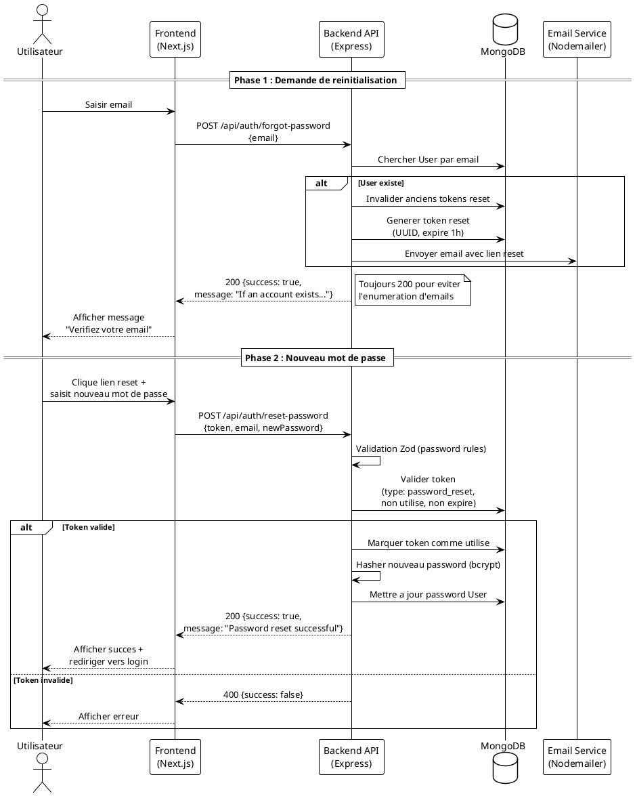

### 3.8 Gestion Profil (Consulter & Modifier)

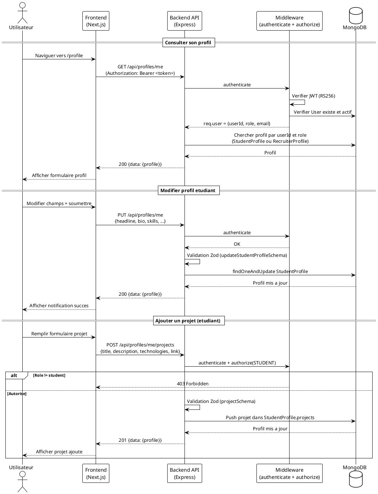

### 3.9 Deconnexion (Logout)

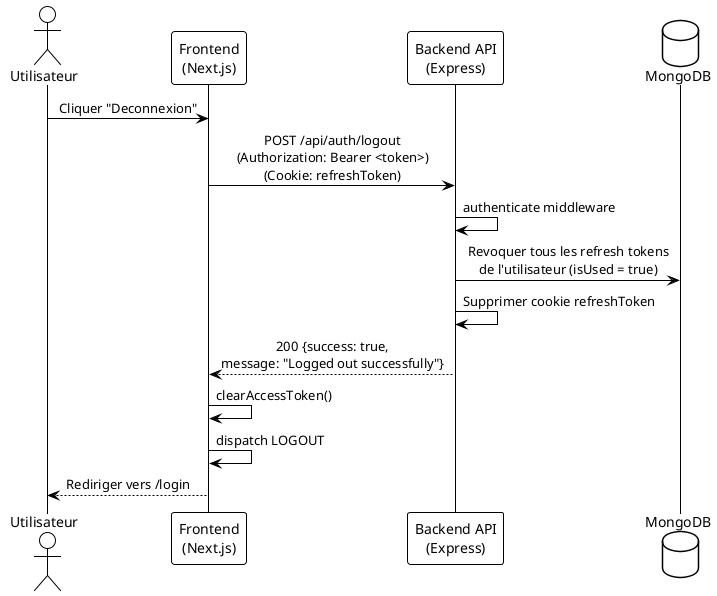

### 3.10 Suppression de Compte (Delete Account)

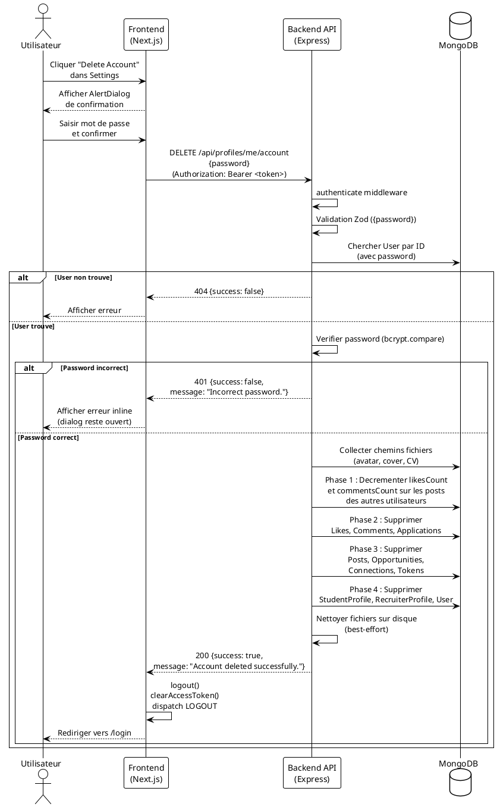

---

## 4. Diagramme de Classes — Sprint 1

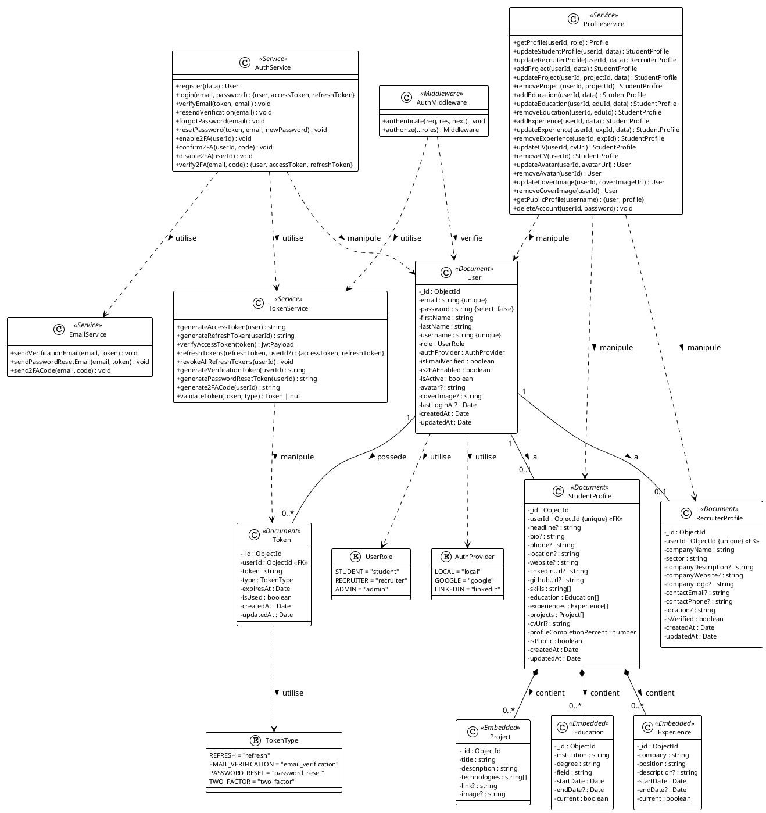

---

## 5. Diagramme de Deploiement

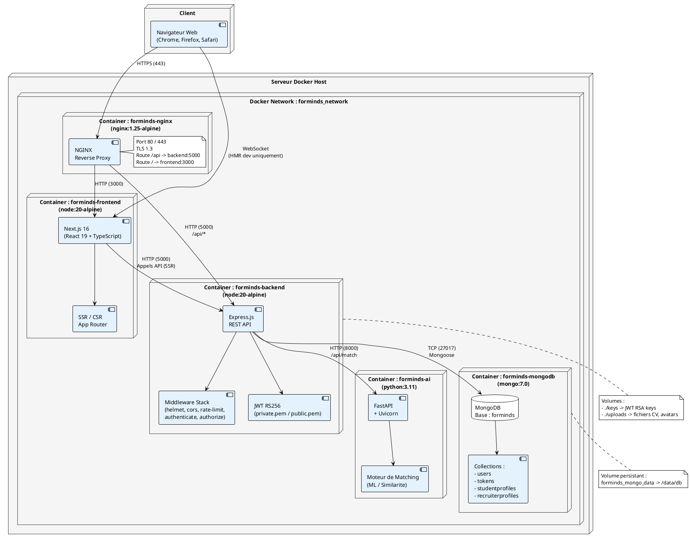

---

## Legende

| Diagramme | Description |
|-----------|-------------|
| **1. UC Global** | Vision macro de tous les cas d'utilisation du projet (tous sprints confondus) |
| **2. UC Sprint 1** | Cas d'utilisation specifiques au Sprint 1 (BF-001 + BF-002 partiel) |
| **3. Sequences** | Flux detailles des interactions pour chaque fonctionnalite du Sprint 1 |
| **4. Classes** | Structure des donnees (modeles MongoDB) et services metier du Sprint 1 |
| **5. Deploiement** | Architecture d'infrastructure avec Docker Compose et NGINX |
