# Diagrammes UML — ForMinds Platform (Sprint 2)

---

## 1. Diagramme de Cas d'Utilisation — Sprint 2

Sprint 2 couvre : **BF-003 (Networking, Annuaire & Minimal Social Feed)** + **BF-004 (Opportunites & Candidatures)**

```plantuml
@startuml UC_Sprint2
!theme plain
skinparam actorStyle awesome
skinparam packageStyle rectangle
skinparam usecaseBackgroundColor #FFF3E0
skinparam usecaseBorderColor #E65100
skinparam actorBackgroundColor #FFCC00
left to right direction

actor "Etudiant" as student
actor "Recruteur" as recruiter
actor "Admin" as admin
actor "Service Email\n(Nodemailer)" as email <<system>>

rectangle "ForMinds — Sprint 2" {

  package "BF-003 : Networking, Annuaire & Social Feed" {
    usecase "Envoyer demande\nde connexion" as UC_SEND_CONN
    usecase "Accepter connexion" as UC_ACCEPT_CONN
    usecase "Refuser connexion" as UC_REJECT_CONN
    usecase "Consulter liste\nde connexions" as UC_LIST_CONN
    usecase "Voir suggestions\nde connexion" as UC_SUGGEST_CONN
    usecase "Supprimer\nune connexion" as UC_REMOVE_CONN
    usecase "Consulter annuaire\ndes profils" as UC_DIRECTORY
    usecase "Rechercher profils\n(skills, domaine, ville)" as UC_SEARCH_PROFILES

    ' --- Minimal Social Feed ---
    usecase "Creer un post" as UC_CREATE_POST
    usecase "Consulter le fil\nd'actualite" as UC_VIEW_FEED
    usecase "Modifier son post" as UC_EDIT_POST
    usecase "Supprimer son post" as UC_DELETE_POST
    usecase "Liker un post" as UC_LIKE_POST
    usecase "Commenter un post" as UC_COMMENT_POST
    usecase "Supprimer\nun commentaire" as UC_DELETE_COMMENT
    usecase "Moderer les posts\net commentaires" as UC_MODERATE_FEED
  }

  package "BF-004 : Opportunites & Candidatures" {
    usecase "Publier une\nopportunite" as UC_POST_OPP
    usecase "Modifier une\nopportunite" as UC_EDIT_OPP
    usecase "Fermer une\nopportunite" as UC_CLOSE_OPP
    usecase "Rechercher\nopportunites" as UC_SEARCH_OPP
    usecase "Consulter detail\nopportunite" as UC_VIEW_OPP
    usecase "Postuler a une\nopportunite (1-click)" as UC_APPLY
    usecase "Suivre ses\ncandidatures" as UC_TRACK_APP_STU
    usecase "Consulter candidatures\nrecues" as UC_TRACK_APP_REC
    usecase "Mettre a jour statut\ncandidature" as UC_UPDATE_APP_STATUS
  }
}

' --- Etudiant ---
student --> UC_SEND_CONN
student --> UC_ACCEPT_CONN
student --> UC_REJECT_CONN
student --> UC_LIST_CONN
student --> UC_SUGGEST_CONN
student --> UC_REMOVE_CONN
student --> UC_DIRECTORY
student --> UC_SEARCH_PROFILES
student --> UC_SEARCH_OPP
student --> UC_VIEW_OPP
student --> UC_APPLY
student --> UC_TRACK_APP_STU
student --> UC_CREATE_POST
student --> UC_VIEW_FEED
student --> UC_EDIT_POST
student --> UC_DELETE_POST
student --> UC_LIKE_POST
student --> UC_COMMENT_POST
student --> UC_DELETE_COMMENT

' --- Recruteur ---
recruiter --> UC_SEND_CONN
recruiter --> UC_ACCEPT_CONN
recruiter --> UC_REJECT_CONN
recruiter --> UC_LIST_CONN
recruiter --> UC_SUGGEST_CONN
recruiter --> UC_REMOVE_CONN
recruiter --> UC_DIRECTORY
recruiter --> UC_SEARCH_PROFILES
recruiter --> UC_POST_OPP
recruiter --> UC_EDIT_OPP
recruiter --> UC_CLOSE_OPP
recruiter --> UC_SEARCH_OPP
recruiter --> UC_VIEW_OPP
recruiter --> UC_TRACK_APP_REC
recruiter --> UC_UPDATE_APP_STATUS
recruiter --> UC_CREATE_POST
recruiter --> UC_VIEW_FEED
recruiter --> UC_EDIT_POST
recruiter --> UC_DELETE_POST
recruiter --> UC_LIKE_POST
recruiter --> UC_COMMENT_POST
recruiter --> UC_DELETE_COMMENT

' --- Admin ---
admin --> UC_DIRECTORY
admin --> UC_SEARCH_PROFILES
admin --> UC_CREATE_POST
admin --> UC_VIEW_FEED
admin --> UC_EDIT_POST
admin --> UC_DELETE_POST
admin --> UC_LIKE_POST
admin --> UC_COMMENT_POST
admin --> UC_DELETE_COMMENT
admin --> UC_MODERATE_FEED

' --- Relations ---
UC_APPLY ..> email : <<include>>\nNotification recruteur
UC_UPDATE_APP_STATUS ..> email : <<include>>\nNotification etudiant
UC_SEND_CONN ..> email : <<extend>>\nNotification destinataire
UC_ACCEPT_CONN ..> email : <<extend>>\nNotification expediteur

@enduml
```

---

## 2. Diagrammes de Sequence — Sprint 2

### 2.1 Envoyer une Demande de Connexion (BF-003)

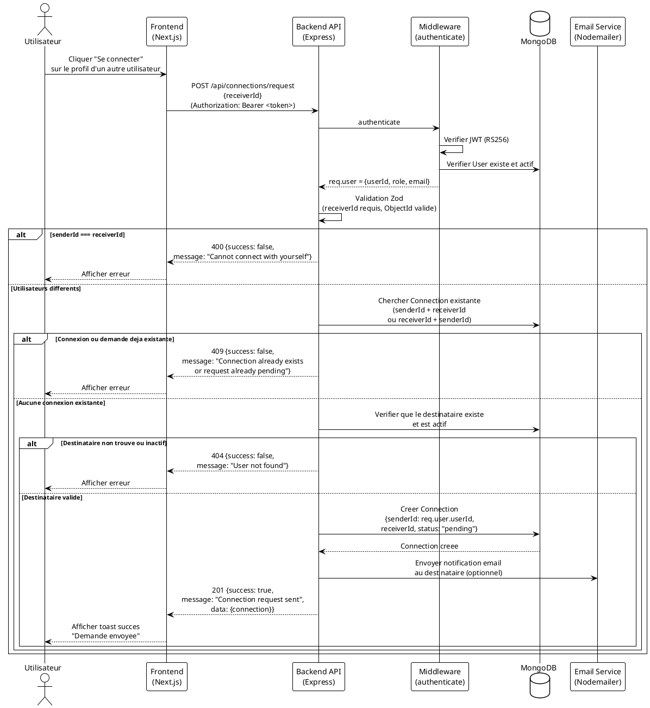

### 2.2 Accepter / Refuser une Connexion (BF-003)

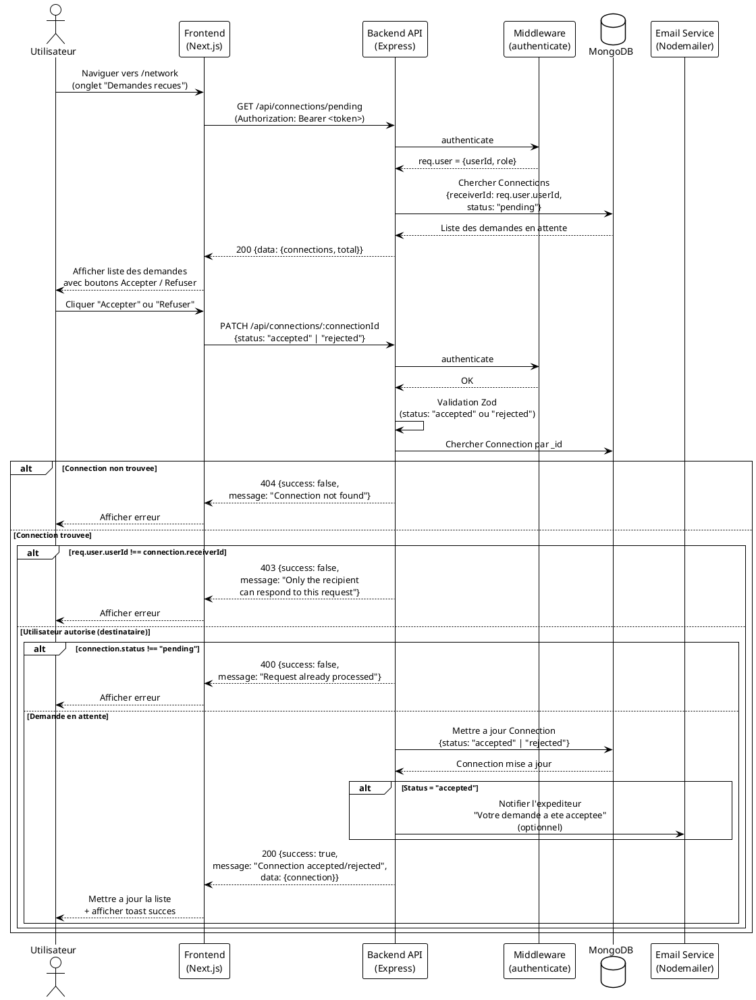

### 2.3 Consulter l'Annuaire / Rechercher des Profils (BF-003)

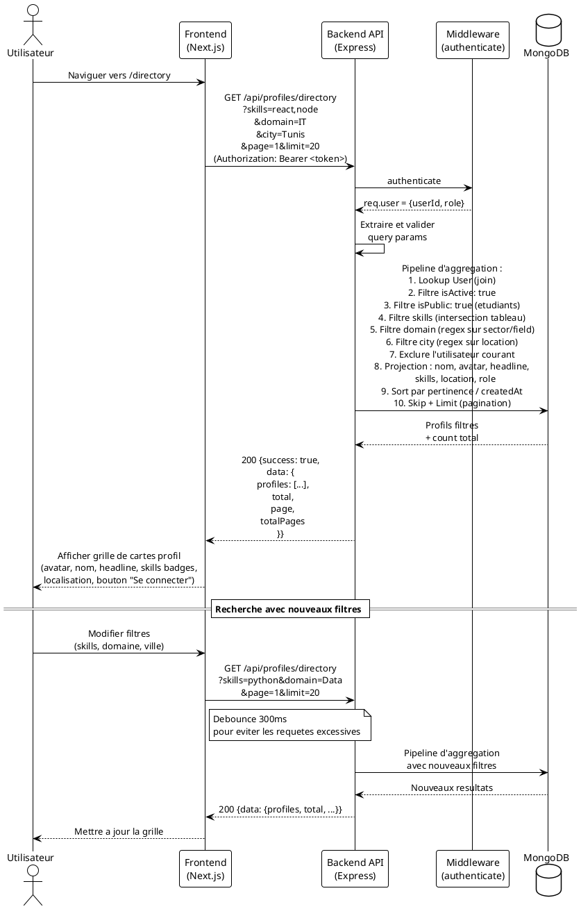

### 2.4 Publier une Opportunite (BF-004 — Recruteur)

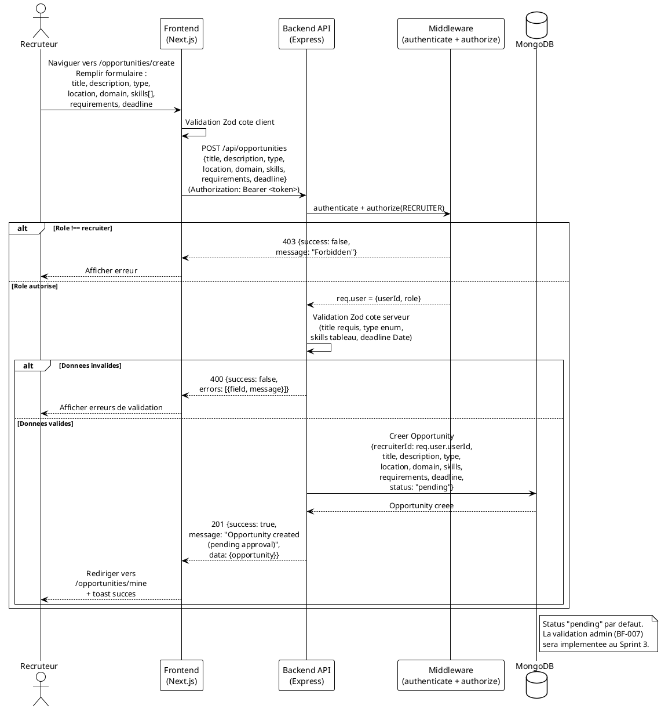

### 2.5 Rechercher des Opportunites (BF-004)

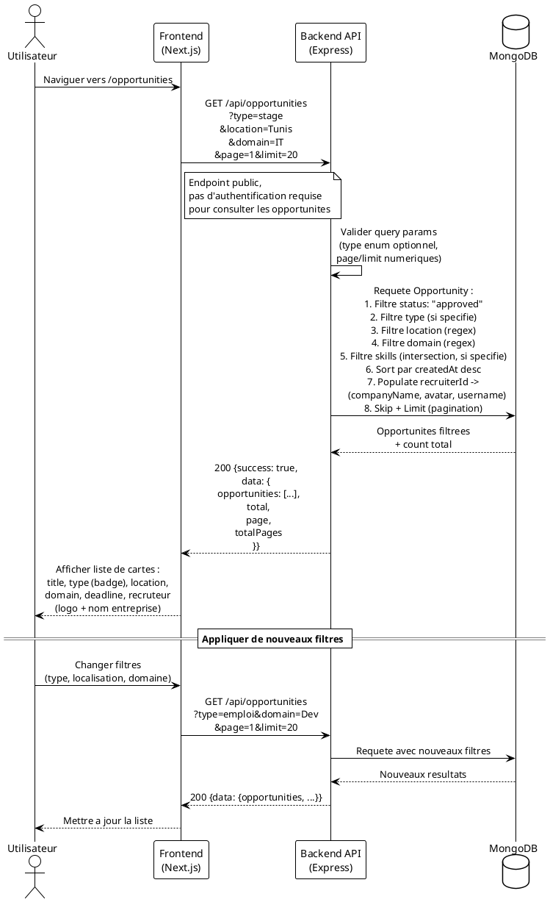

### 2.6 Postuler a une Opportunite (BF-004 — Etudiant)

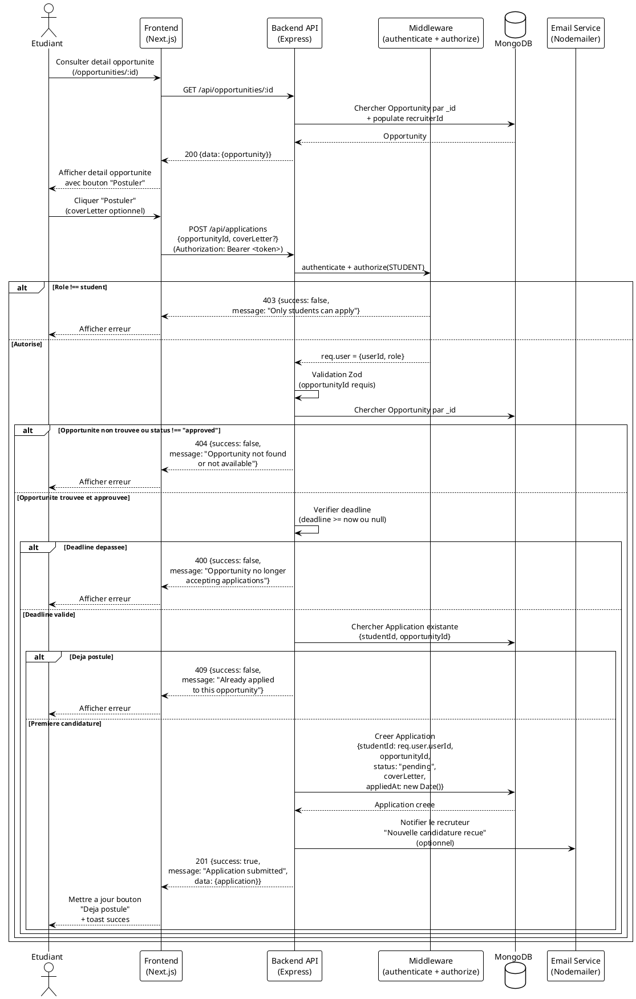

### 2.7 Suivre les Candidatures (BF-004 — Etudiant & Recruteur)

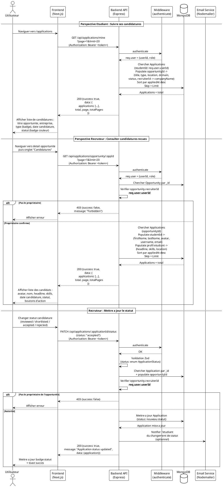

### 2.8 Creer / Modifier / Supprimer un Post — Social Feed (BF-003)

```plantuml
@startuml SEQ_PostCRUD
!theme plain
skinparam sequenceMessageAlign center

actor Utilisateur as user
participant "Frontend\n(Next.js)" as front
participant "Backend API\n(Express)" as api
participant "Middleware\n(authenticate)" as mw
database "MongoDB" as db

== Creer un Post ==

user -> front : Remplir formulaire\n(contenu texte)
front -> front : Validation Zod cote client\n(content requis, max 2000 car.)
front -> api : POST /api/posts\n{content}\n(Authorization: Bearer <token>)

api -> mw : authenticate
mw --> api : req.user = {userId, role}

api -> api : Validation Zod serveur\n(content: string, 1-2000 car.)

alt Donnees invalides
  api --> front : 400 {success: false,\nerrors: [{field, message}]}
  front --> user : Afficher erreurs
else Donnees valides
  api -> db : Creer Post\n{authorId: req.user.userId,\ncontent, likesCount: 0,\ncommentsCount: 0}
  db --> api : Post cree
  api --> front : 201 {success: true,\nmessage: "Post created",\ndata: {post}}
  front --> user : Ajouter le post\nen haut du fil\n+ toast succes
end

== Modifier un Post ==

user -> front : Cliquer "Modifier"\nsur son propre post
front -> front : Afficher editeur\navec contenu actuel
user -> front : Modifier le contenu\net valider
front -> api : PATCH /api/posts/:postId\n{content}\n(Authorization: Bearer <token>)

api -> mw : authenticate
mw --> api : req.user = {userId, role}

api -> db : Chercher Post par _id
alt Post non trouve
  api --> front : 404 {success: false,\nmessage: "Post not found"}
  front --> user : Afficher erreur
else Post trouve
  alt req.user.userId !== post.authorId\nAND req.user.role !== "admin"
    api --> front : 403 {success: false,\nmessage: "Forbidden"}
    front --> user : Afficher erreur
  else Autorise (auteur ou admin)
    api -> api : Validation Zod\n(content: 1-2000 car.)
    api -> db : Mettre a jour Post\n{content, updatedAt}
    db --> api : Post mis a jour
    api --> front : 200 {success: true,\nmessage: "Post updated",\ndata: {post}}
    front --> user : Mettre a jour le post\ndans le fil + toast succes
  end
end

== Supprimer un Post ==

user -> front : Cliquer "Supprimer"\nsur son propre post
front -> front : Afficher dialogue\nde confirmation
user -> front : Confirmer suppression
front -> api : DELETE /api/posts/:postId\n(Authorization: Bearer <token>)

api -> mw : authenticate
mw --> api : req.user = {userId, role}

api -> db : Chercher Post par _id
alt Post non trouve
  api --> front : 404 {success: false,\nmessage: "Post not found"}
  front --> user : Afficher erreur
else Post trouve
  alt req.user.userId !== post.authorId\nAND req.user.role !== "admin"
    api --> front : 403 {success: false,\nmessage: "Forbidden"}
    front --> user : Afficher erreur
  else Autorise (auteur ou admin)
    api -> db : Supprimer Post par _id
    api -> db : Supprimer tous les Likes\nassocies au post
    api -> db : Supprimer tous les Commentaires\nassocies au post
    db --> api : Suppression effectuee
    api --> front : 200 {success: true,\nmessage: "Post deleted"}
    front --> user : Retirer le post du fil\n+ toast succes
  end
end

@enduml
```

### 2.9 Consulter le Fil d'Actualite — Social Feed (BF-003)

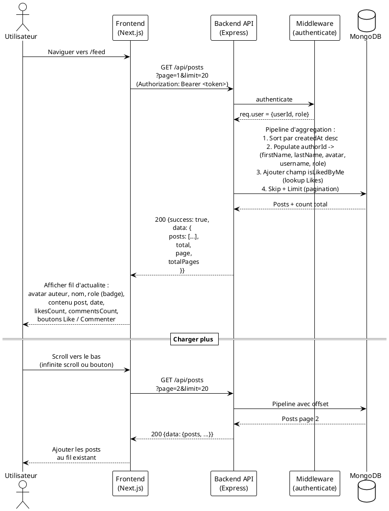

### 2.10 Liker / Unliker un Post — Social Feed (BF-003)

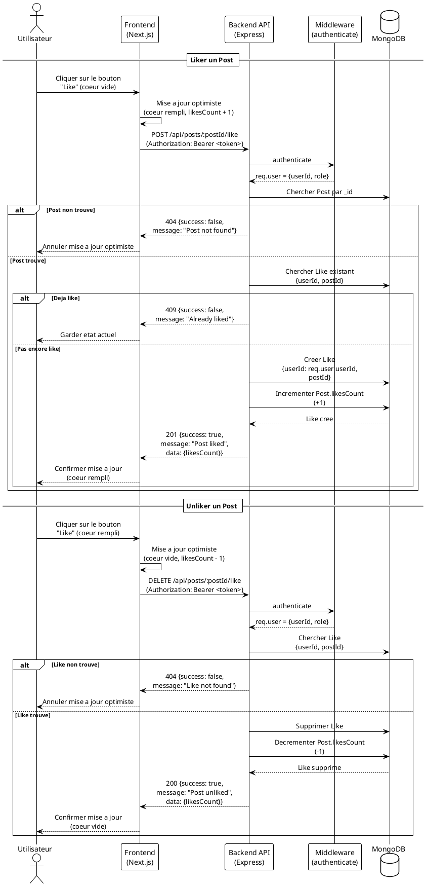

### 2.11 Commenter un Post — Social Feed (BF-003)

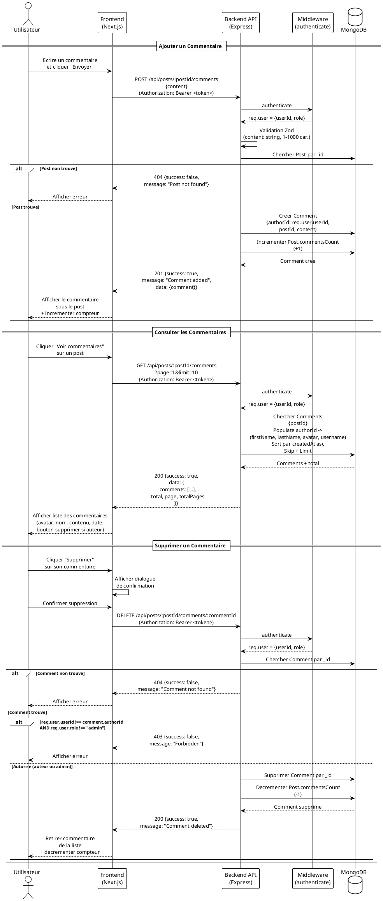

---

## 3. Diagramme de Classes — Sprint 2

```plantuml
@startuml CLASS_Sprint2
!theme plain
skinparam classAttributeIconSize 0
skinparam classFontSize 13
skinparam classAttributeFontSize 11

' ============================================================
' MODELES EXISTANTS (Sprint 1) - contexte
' ============================================================

class User <<Document>> #E8F5E9 {
  - _id : ObjectId
  - email : string {unique}
  - password : string {select: false}
  - firstName : string
  - lastName : string
  - username : string {unique}
  - role : UserRole
  - authProvider : AuthProvider
  - isEmailVerified : boolean
  - is2FAEnabled : boolean
  - isActive : boolean
  - avatar? : string
  - coverImage? : string
  - lastLoginAt? : Date
  - createdAt : Date
  - updatedAt : Date
}

class StudentProfile <<Document>> #E8F5E9 {
  - _id : ObjectId
  - userId : ObjectId {unique} <<FK>>
  - headline? : string
  - bio? : string
  - skills : string[]
  - location? : string
  - education : Education[]
  - experiences : Experience[]
  - projects : Project[]
  - profileCompletionPercent : number
  - isPublic : boolean
}

class RecruiterProfile <<Document>> #E8F5E9 {
  - _id : ObjectId
  - userId : ObjectId {unique} <<FK>>
  - companyName : string
  - sector : string
  - companyDescription? : string
  - location? : string
  - isVerified : boolean
}

note right of User
  Modeles existants du Sprint 1.
  Fond vert = deja implementes.
end note

' ============================================================
' NOUVEAUX ENUMS (Sprint 2)
' ============================================================

enum ConnectionStatus {
  PENDING = "pending"
  ACCEPTED = "accepted"
  REJECTED = "rejected"
}

enum OpportunityType {
  STAGE = "stage"
  EMPLOI = "emploi"
  BENEVOLAT = "benevolat"
}

enum OpportunityStatus {
  PENDING = "pending"
  APPROVED = "approved"
  REJECTED = "rejected"
  CLOSED = "closed"
}

enum ApplicationStatus {
  PENDING = "pending"
  REVIEWED = "reviewed"
  SHORTLISTED = "shortlisted"
  ACCEPTED = "accepted"
  REJECTED = "rejected"
}

' ============================================================
' NOUVEAUX MODELES (Sprint 2)
' ============================================================

class Connection <<Document>> #FFF3E0 {
  - _id : ObjectId
  - senderId : ObjectId <<FK>>
  - receiverId : ObjectId <<FK>>
  - status : ConnectionStatus
  - createdAt : Date
  - updatedAt : Date
  __
  Index: {senderId, receiverId} unique
  Index: {receiverId, status}
  Index: {senderId, status}
}

class Opportunity <<Document>> #FFF3E0 {
  - _id : ObjectId
  - recruiterId : ObjectId <<FK>>
  - title : string
  - description : string
  - type : OpportunityType
  - location : string
  - domain : string
  - skills : string[]
  - requirements? : string
  - deadline? : Date
  - status : OpportunityStatus
  - createdAt : Date
  - updatedAt : Date
  __
  Index: {recruiterId}
  Index: {status, type}
  Index: {skills}
  Index: {domain}
  Index: {location}
}

class Application <<Document>> #FFF3E0 {
  - _id : ObjectId
  - studentId : ObjectId <<FK>>
  - opportunityId : ObjectId <<FK>>
  - status : ApplicationStatus
  - coverLetter? : string
  - appliedAt : Date
  - updatedAt : Date
  __
  Index: {studentId, opportunityId} unique
  Index: {opportunityId, status}
  Index: {studentId}
}

class Post <<Document>> #FFF3E0 {
  - _id : ObjectId
  - authorId : ObjectId <<FK>>
  - content : string {1-2000}
  - likesCount : number {default: 0}
  - commentsCount : number {default: 0}
  - createdAt : Date
  - updatedAt : Date
  __
  Index: {authorId}
  Index: {createdAt}
}

class Like <<Document>> #FFF3E0 {
  - _id : ObjectId
  - userId : ObjectId <<FK>>
  - postId : ObjectId <<FK>>
  - createdAt : Date
  __
  Index: {userId, postId} unique
  Index: {postId}
}

class Comment <<Document>> #FFF3E0 {
  - _id : ObjectId
  - authorId : ObjectId <<FK>>
  - postId : ObjectId <<FK>>
  - content : string {1-1000}
  - createdAt : Date
  - updatedAt : Date
  __
  Index: {postId, createdAt}
  Index: {authorId}
}

note right of Connection
  Nouveaux modeles du Sprint 2.
  Fond orange = a implementer.
end note

' ============================================================
' NOUVEAUX SERVICES (Sprint 2)
' ============================================================

class ConnectionService <<Service>> {
  + sendRequest(senderId, receiverId) : Connection
  + respondToRequest(connectionId, userId, status) : Connection
  + getConnections(userId, page, limit) : {connections, total}
  + getPendingRequests(userId, page, limit) : {connections, total}
  + getSentRequests(userId, page, limit) : {connections, total}
  + getSuggestions(userId, limit) : User[]
  + removeConnection(connectionId, userId) : void
  + getConnectionStatus(userId1, userId2) : string | null
}

class OpportunityService <<Service>> {
  + createOpportunity(recruiterId, data) : Opportunity
  + updateOpportunity(opportunityId, recruiterId, data) : Opportunity
  + closeOpportunity(opportunityId, recruiterId) : Opportunity
  + getOpportunity(opportunityId) : Opportunity
  + searchOpportunities(filters, page, limit) : {opportunities, total}
  + getRecruiterOpportunities(recruiterId, page, limit) : {opportunities, total}
}

class ApplicationService <<Service>> {
  + apply(studentId, opportunityId, coverLetter?) : Application
  + getStudentApplications(studentId, page, limit) : {applications, total}
  + getOpportunityApplications(oppId, recruiterId, page, limit) : {applications, total}
  + updateApplicationStatus(applicationId, recruiterId, status) : Application
  + getApplication(applicationId) : Application
}

class DirectoryService <<Service>> {
  + searchProfiles(filters, page, limit) : {profiles, total}
}

class PostService <<Service>> {
  + createPost(authorId, content) : Post
  + updatePost(postId, userId, role, content) : Post
  + deletePost(postId, userId, role) : void
  + getFeed(userId, page, limit) : {posts, total}
  + getPost(postId) : Post
  + likePost(userId, postId) : Like
  + unlikePost(userId, postId) : void
  + addComment(authorId, postId, content) : Comment
  + getComments(postId, page, limit) : {comments, total}
  + deleteComment(commentId, userId, role) : void
}

' ============================================================
' SERVICE EXISTANT (Sprint 1)
' ============================================================

class EmailService <<Service>> #E8F5E9 {
  + sendVerificationEmail(email, firstName, token) : void
  + sendPasswordResetEmail(email, firstName, token) : void
  + send2FACode(email, firstName, code) : void
  + sendConnectionNotification(email, firstName, senderName) : void
  + sendApplicationNotification(email, opportunityTitle, applicantName) : void
  + sendApplicationStatusUpdate(email, firstName, opportunityTitle, status) : void
}

note left of EmailService
  Methodes en italique =
  nouvelles methodes ajoutees
  au Sprint 2.
end note

' ============================================================
' RELATIONS
' ============================================================

' --- FK Relations ---
User "1" -- "0..*" Connection : envoie\n(senderId) >
User "1" -- "0..*" Connection : recoit\n(receiverId) >
User "1" -- "0..*" Opportunity : publie\n(recruiterId) >
User "1" -- "0..*" Application : postule\n(studentId) >
Opportunity "1" -- "0..*" Application : recoit >
User "1" -- "0..1" StudentProfile : a >
User "1" -- "0..1" RecruiterProfile : a >
User "1" -- "0..*" Post : publie\n(authorId) >
User "1" -- "0..*" Like : donne\n(userId) >
User "1" -- "0..*" Comment : redige\n(authorId) >
Post "1" -- "0..*" Like : recoit >
Post "1" -- "0..*" Comment : contient >

' --- Enum usage ---
Connection ..> ConnectionStatus : utilise >
Opportunity ..> OpportunityType : utilise >
Opportunity ..> OpportunityStatus : utilise >
Application ..> ApplicationStatus : utilise >

' --- Service dependencies ---
ConnectionService ..> Connection : manipule >
ConnectionService ..> User : consulte >
ConnectionService ..> EmailService : utilise >
OpportunityService ..> Opportunity : manipule >
OpportunityService ..> User : consulte >
ApplicationService ..> Application : manipule >
ApplicationService ..> Opportunity : consulte >
ApplicationService ..> User : consulte >
ApplicationService ..> EmailService : utilise >
DirectoryService ..> StudentProfile : consulte >
DirectoryService ..> RecruiterProfile : consulte >
DirectoryService ..> User : consulte >
PostService ..> Post : manipule >
PostService ..> Like : manipule >
PostService ..> Comment : manipule >
PostService ..> User : consulte >

@enduml
```

---

## 4. Diagramme d'Activite — Workflow Candidature Opportunite

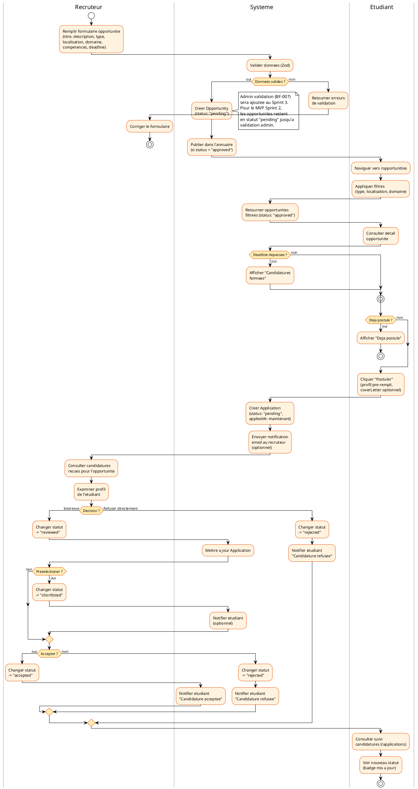

---

## Legende

| Diagramme | Description |
|-----------|-------------|
| **1. UC Sprint 2** | Cas d'utilisation specifiques au Sprint 2 : BF-003 (Networking, Annuaire & Social Feed) + BF-004 (Opportunites & Candidatures) |
| **2. Sequences** | Flux detailles des interactions pour chaque fonctionnalite du Sprint 2 (11 diagrammes : 3 Networking, 4 Opportunites, 4 Social Feed) |
| **3. Classes** | Nouveaux modeles de donnees (Connection, Opportunity, Application, Post, Like, Comment), enums et services. Les modeles Sprint 1 sont affiches en contexte (fond vert) |
| **4. Activite** | Workflow complet du cycle de vie d'une candidature : publication -> recherche -> candidature -> evaluation -> decision |

---

*Document genere pour le Sprint 2 de la plateforme ForMinds.*
*Couvre les fonctionnalites BF-003 (Networking, Annuaire & Minimal Social Feed) et BF-004 (Opportunites & Candidatures).*
