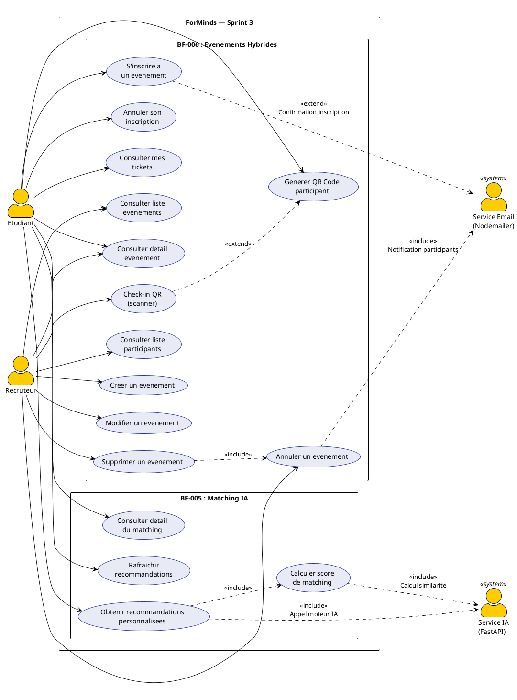
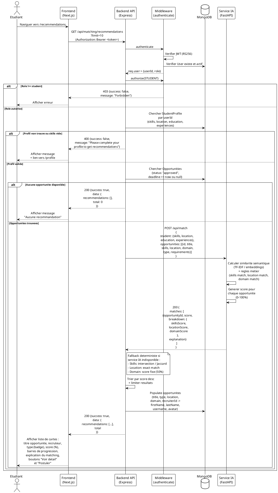
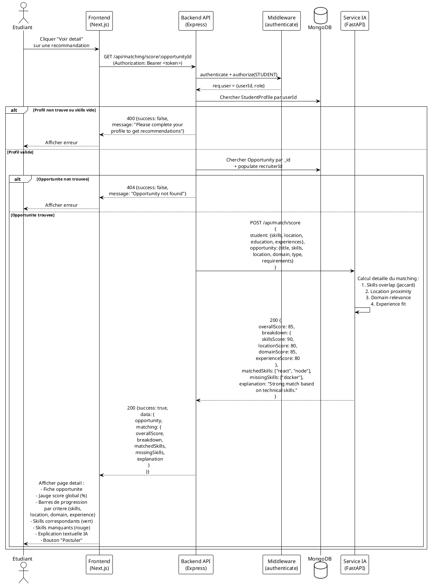
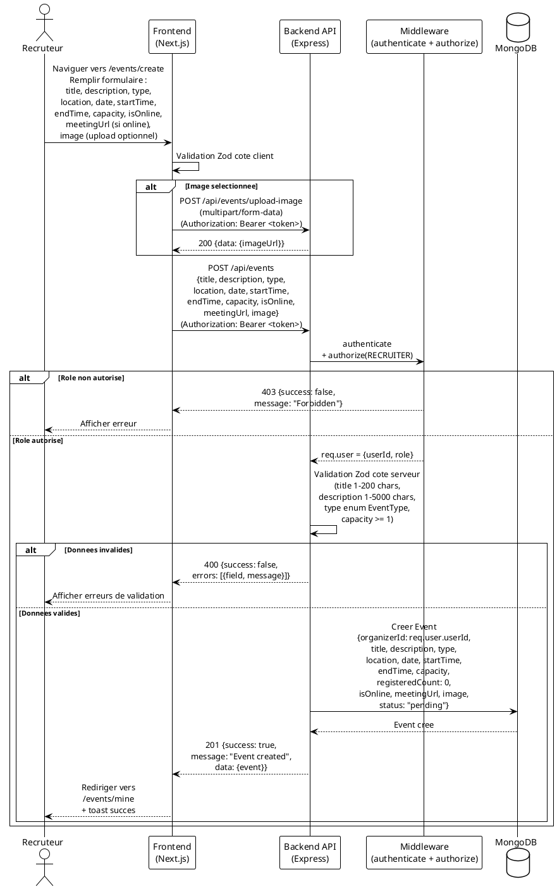
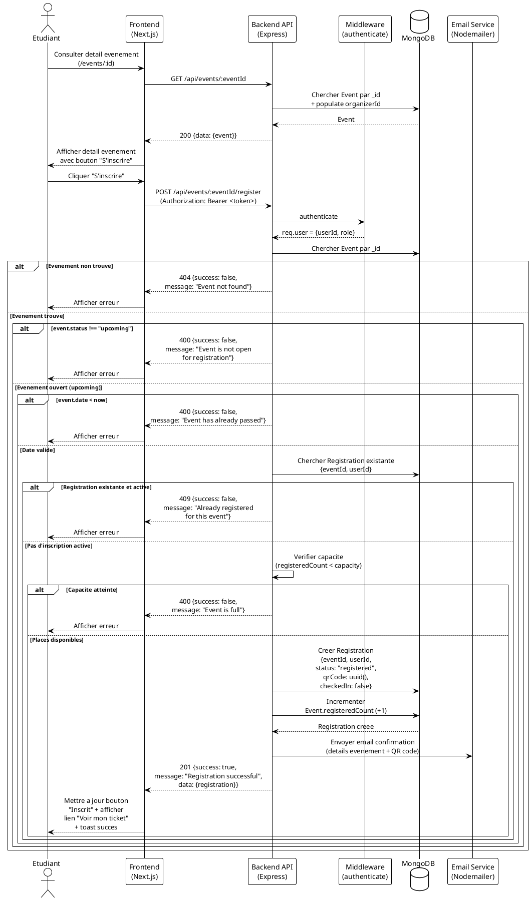
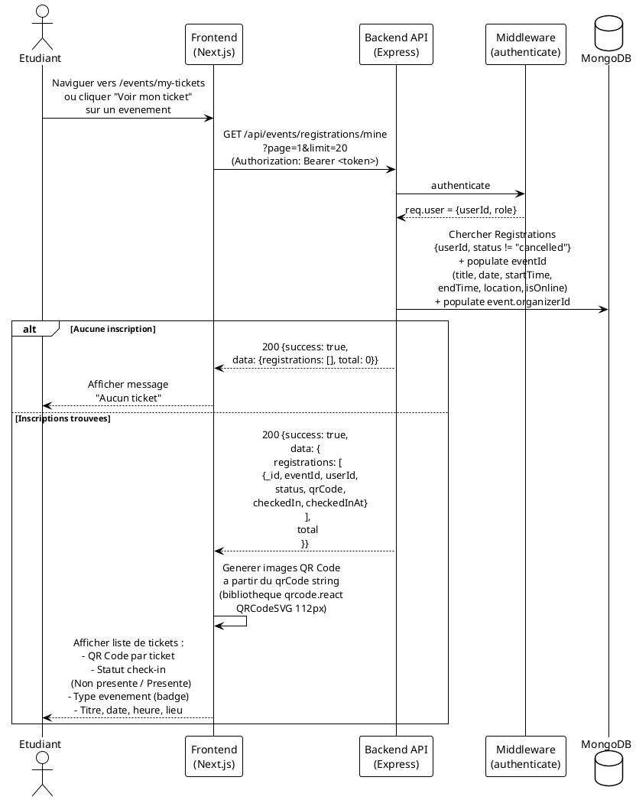
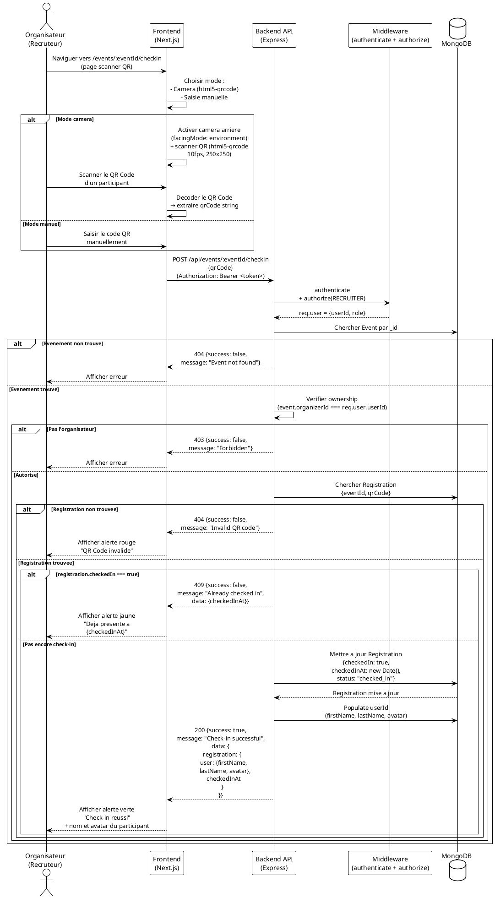
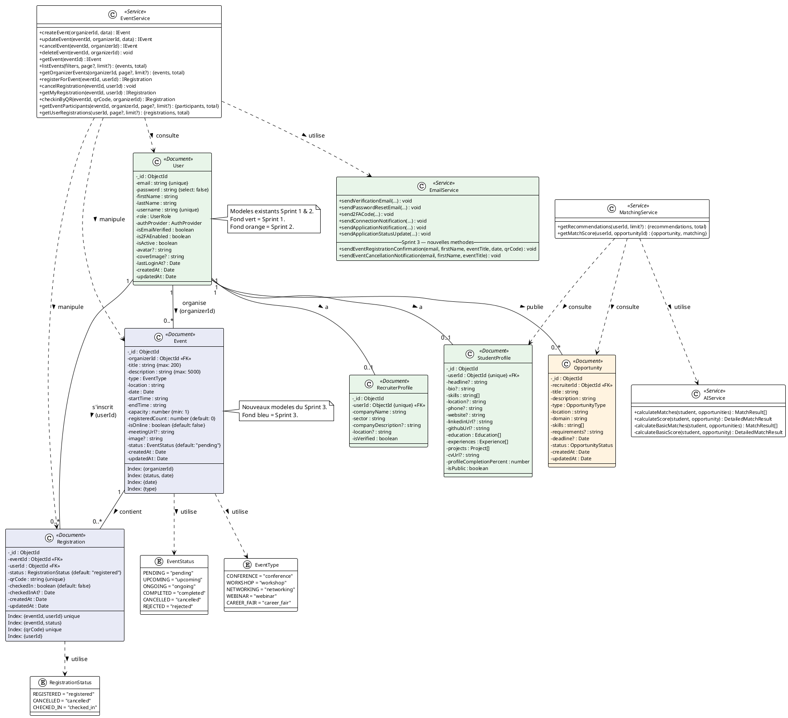
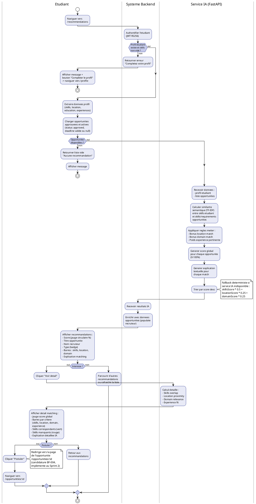

# Diagrammes UML — ForMinds Platform (Sprint 3)

---

## 1. Diagramme de Cas d'Utilisation — Sprint 3

Sprint 3 couvre : **BF-005 (Matching IA)** + **BF-006 (Evenements Hybrides & QR Code)**



---

## 2. Diagrammes de Sequence — Sprint 3

### 2.1 Obtenir des Recommandations Personnalisees (BF-005)



### 2.2 Consulter le Detail du Matching (BF-005)



### 2.3 Creer un Evenement (BF-006 — Recruteur)



### 2.4 S'inscrire a un Evenement (BF-006 — Etudiant)



### 2.5 Generer et Afficher le QR Code Participant (BF-006)



### 2.6 Check-in QR Code (BF-006 — Organisateur)



---

## 3. Diagramme de Classes — Sprint 3



---

## 4. Diagramme d'Activite — Workflow de Matching IA



---

## 5. Diagramme d'Activite — Workflow Evenement Hybride

```plantuml
@startuml ACT_EventWorkflow
!theme plain
skinparam activityBackgroundColor #E8EAF6
skinparam activityBorderColor #283593
skinparam activityDiamondBackgroundColor #C5CAE9
skinparam activityDiamondBorderColor #283593
skinparam swimlaneBackgroundColor #FAFAFA
skinparam swimlaneBorderColor #999999

|Organisateur (Recruteur)|
start
:Creer un evenement\n(titre, description, type,\nlieu, date, horaires,\ncapacite, online/presentiel,\nimage optionnelle);

|Systeme|
:Valider donnees (Zod);
if (Donnees valides ?) then (oui)
  :Creer Event\n(status: "pending",\nregisteredCount: 0);
  note right
    L'evenement est en attente
    de validation par l'admin
    (BF-007, Sprint 4).
  end note
else (non)
  :Retourner erreurs\nde validation;
  |Organisateur (Recruteur)|
  :Corriger le formulaire;
  detach
endif

== Validation par Admin (Sprint 4) ==

|Admin|
:Approuver l'evenement\n(status -> "upcoming");

== Evenement disponible ==

|Etudiant|
:Naviguer vers /events;
:Consulter les evenements\ndisponibles (filtres :\ntype, recherche);

|Systeme|
:Retourner evenements\n{status: "upcoming",\ndate >= now};

|Etudiant|
:Consulter detail\nd'un evenement;

|Systeme|
if (Places disponibles ?) then (oui)
  |Etudiant|
  :Cliquer "S'inscrire";

  |Systeme|
  :Verifier pas deja inscrit;
  :Verifier capacite;

  if (Tout valide ?) then (oui)
    :Creer Registration\n+ generer QR Code unique\n(UUID v4);
    :Incrementer registeredCount;
    :Envoyer email confirmation\n+ QR Code;

    |Etudiant|
    :Recevoir confirmation\n+ QR Code par email;
    :Acceder a "Mes Tickets"\n(/events/my-tickets);

    |Systeme|
    :Afficher QR Code\ndu participant\n(qrcode.react QRCodeSVG);
  else (non)
    :Retourner erreur\n(deja inscrit ou complet);
    |Etudiant|
    :Afficher message d'erreur;
    detach
  endif
else (non)
  |Etudiant|
  :Afficher "Complet";
  detach
endif

== Jour de l'evenement ==

|Organisateur (Recruteur)|
:Ouvrir page check-in\n/events/:id/checkin;
:Choisir mode :\ncamera ou saisie manuelle;

|Etudiant|
:Presenter son QR Code\n(ecran telephone\nou email imprime);

|Organisateur (Recruteur)|
:Scanner / saisir\nle QR Code;

|Systeme|
:Chercher Registration\npar qrCode;

if (QR valide ?) then (oui)
  if (Deja check-in ?) then (non)
    :Marquer checkedIn: true\n+ checkedInAt: now\n+ status: "checked_in";
    :Afficher succes\n+ nom et avatar participant;
    |Organisateur (Recruteur)|
    :Confirmer entree;
  else (oui)
    :Afficher alerte\n"Deja presente";
    |Organisateur (Recruteur)|
    :Informer le participant;
  endif
else (non)
  :Afficher alerte\n"QR invalide";
  |Organisateur (Recruteur)|
  :Refuser entree;
endif

|Organisateur (Recruteur)|
:Consulter liste participants\n+ ratio presences\n(checked-in / total);

stop

@enduml
```

---

## Legende

| Diagramme | Description |
|-----------|-------------|
| **1. UC Sprint 3** | Cas d'utilisation specifiques au Sprint 3 : BF-005 (Matching IA) et BF-006 (Evenements Hybrides). Le recruteur organise les evenements, l'etudiant obtient des recommandations et s'inscrit |
| **2. Sequences** | Flux detailles des interactions pour chaque fonctionnalite du Sprint 3 (6 diagrammes : 2 IA Matching, 4 Evenements). Inclut le fallback deterministe du service IA |
| **3. Classes** | Nouveaux modeles de donnees (Event, Registration), enums (EventType avec 5 types, EventStatus avec 6 statuts incluant pending/rejected, RegistrationStatus) et services (MatchingService, AIService avec fallback, EventService avec 13 methodes). Les modeles Sprint 1 et 2 sont affiches en contexte |
| **4. Activite IA** | Workflow complet du matching IA : extraction profil -> chargement opportunites -> calcul similarite (IA ou fallback) -> scoring -> recommandations -> consultation detail -> candidature |
| **5. Activite Evenement** | Workflow complet du cycle de vie d'un evenement : creation (status pending) -> validation admin -> inscription -> generation QR -> check-in (camera ou manuel) -> consultation presence |

---

*Document genere pour le Sprint 3 de la plateforme ForMinds.*
*Couvre les fonctionnalites BF-005 (Matching IA) et BF-006 (Evenements Hybrides & QR Code).*
*Mis a jour le 10 mars 2026 pour correspondre a l'implementation reelle du code.*
