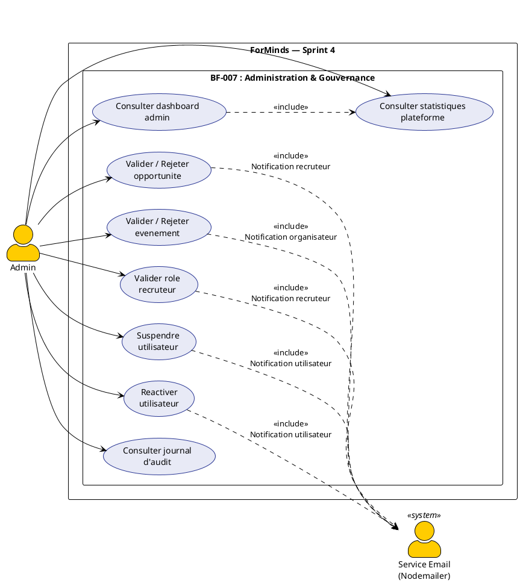
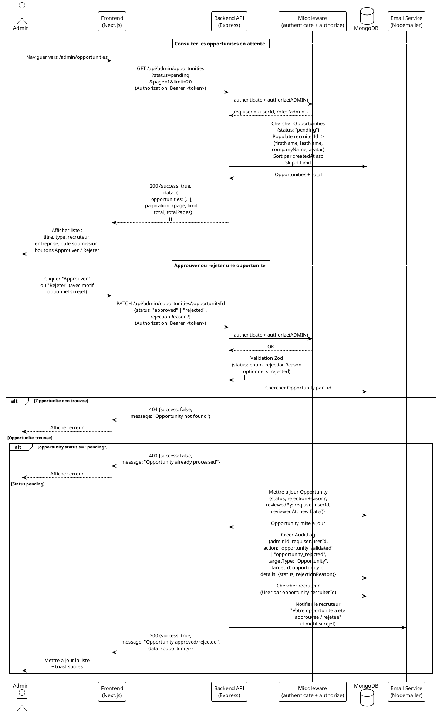
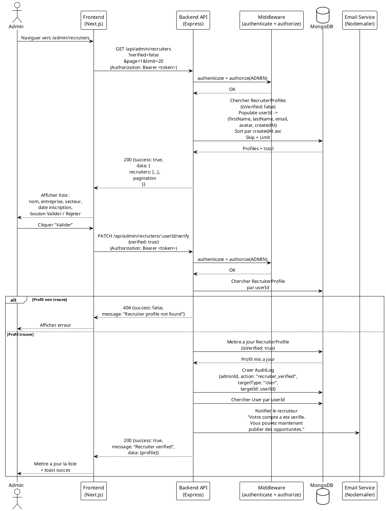
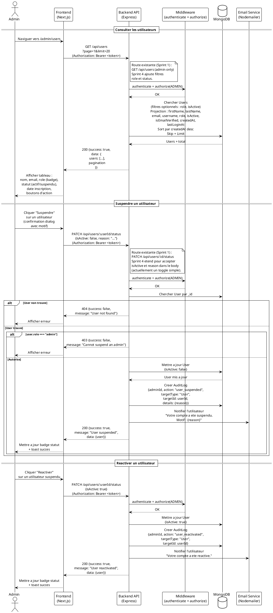
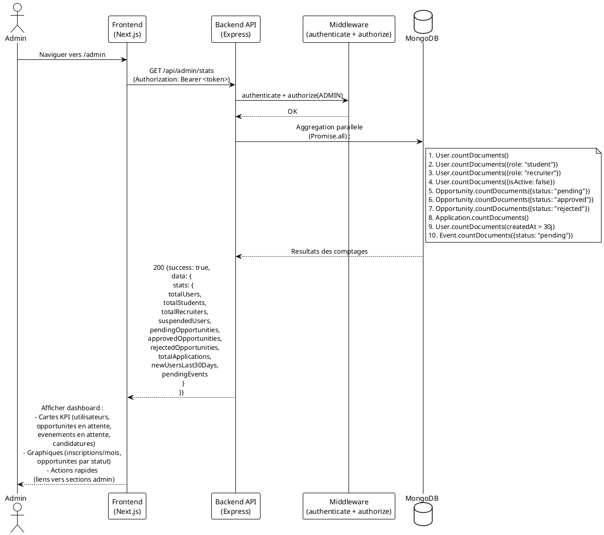
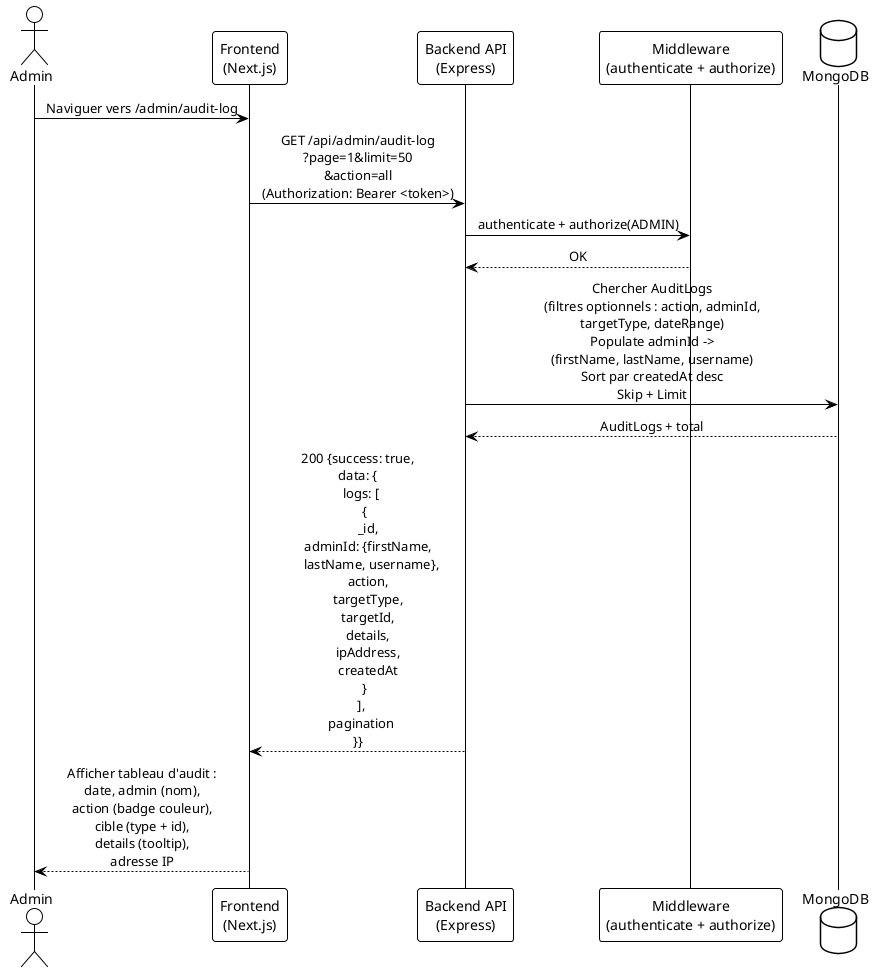
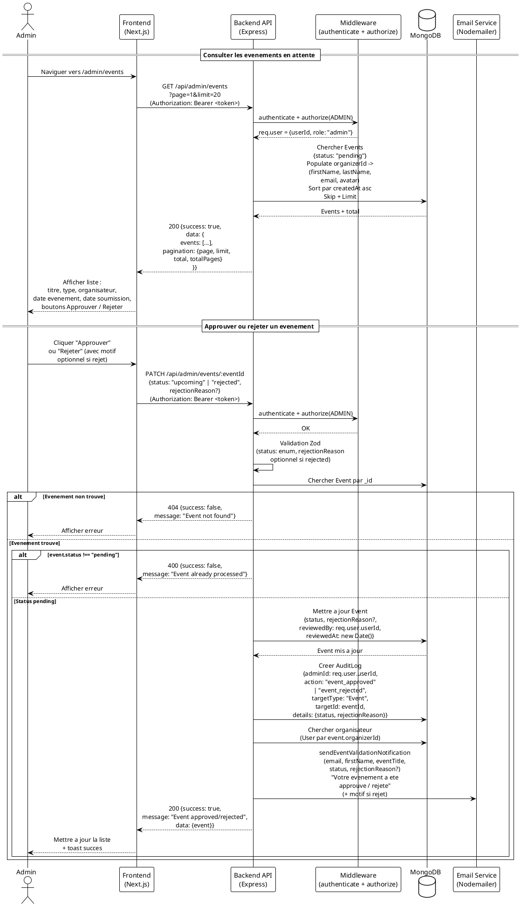
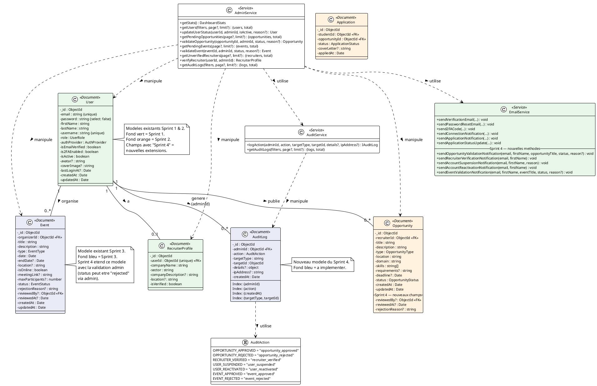
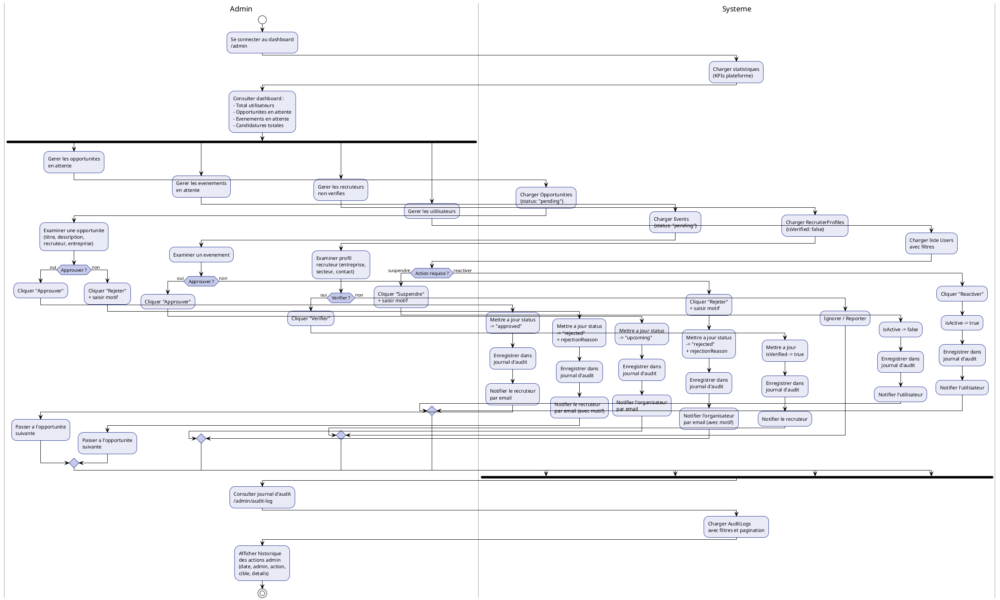

# Diagrammes UML — ForMinds Platform (Sprint 4)

---

## 1. Diagramme de Cas d'Utilisation — Sprint 4

Sprint 4 couvre : **BF-007 (Administration & Gouvernance)**

---

## 2. Diagrammes de Sequence — Sprint 4

### 2.1 Valider / Rejeter une Opportunite (BF-007 — Admin)

### 2.2 Valider le Role Recruteur (BF-007 — Admin)

### 2.3 Suspendre / Reactiver un Utilisateur (BF-007 — Admin)

### 2.4 Dashboard Admin & Statistiques (BF-007)

### 2.5 Consulter le Journal d'Audit (BF-007 — Admin)

### 2.6 Valider / Rejeter un Evenement (BF-007 — Admin)

---

## 3. Diagramme de Classes — Sprint 4

---

## 4. Diagramme d'Activite — Workflow Administration & Gouvernance

---

## Legende

| Diagramme | Description |
|-----------|-------------|
| **1. UC Sprint 4** | Cas d'utilisation specifiques au Sprint 4 : BF-007 (Administration & Gouvernance), incluant la validation des evenements |
| **2. Sequences** | Flux detailles des interactions pour chaque fonctionnalite du Sprint 4 (6 diagrammes : validation opportunites, verification recruteurs, gestion utilisateurs, dashboard admin, journal d'audit, validation evenements) |
| **3. Classes** | Nouveau modele de donnees (AuditLog), enum (AuditAction), extensions du modele Opportunity, modele Event (Sprint 3) etendu avec validation admin, et services (AdminService, AuditService). Les modeles Sprint 1 et 2 sont affiches en contexte |
| **4. Activite Admin** | Workflow du panneau d'administration : dashboard -> validation opportunites -> validation evenements -> verification recruteurs -> gestion utilisateurs -> journal d'audit |

---

*Document genere pour le Sprint 4 de la plateforme ForMinds.*
*Couvre la fonctionnalite BF-007 (Administration & Gouvernance).*
*Mis a jour le 10/03/2026 — ajout de la validation des evenements par l'admin.*
